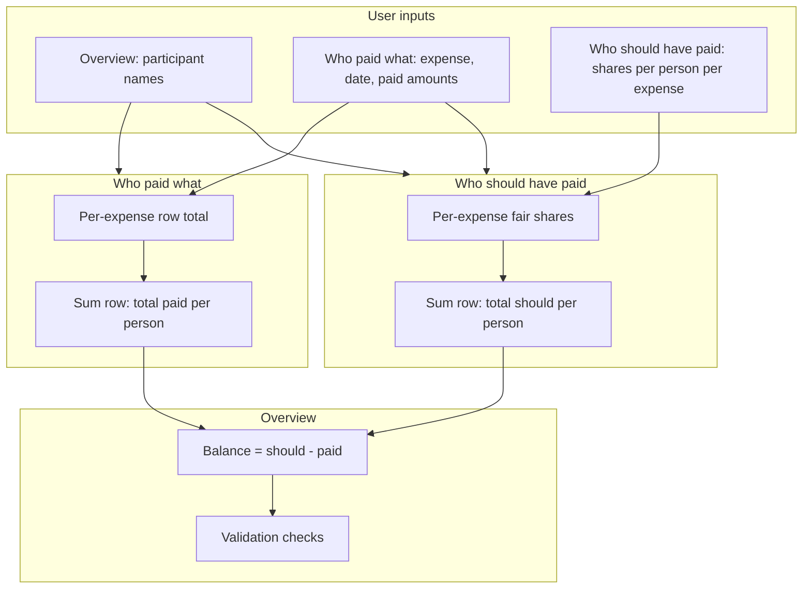

# Shared Expenses — Excel Template Analysis (Phase 1)

**Source files:**

| File | Purpose |
|------|---------|
| `Shabraz expenses template.xlsx` | Empty template (structure only) |
| `ALL PAID - Weekend Getaway 23.05.25.xlsx` | **Filled real event** (primary reference) |

**Analyzed:** 2026-05-25  
**Status:** Implemented in FinanceOS (v21 migration, `/shared` UI). Analysis below remains the spec reference.

---

## 1. Workbook structure

| Sheet | Role | Size (template) |
|-------|------|-----------------|
| **Overview** | Participant list, net balances, validation checks | 1000×26 (sparse) |
| **Who paid what** | Expense log + who actually paid | 46114×38 (mostly empty formula grid) |
| **Who should have paid** | Fair-share allocation per expense | 1001×28 |

**Named range:** `numberOfPeeps` → `Overview!$B$2` (= `COUNTA` of names in column A).

**Platform:** Built as a **Google Sheets** workbook (heavy `ARRAYFORMULA`, `MMULT`, `regexextract`, `INDIRECT`). Exported to `.xlsx`; many array formulas appear as `__xludf.DUMMYFUNCTION("COMPUTED_VALUE")` and **cannot be re-evaluated in Excel**.

**Sample data:** The empty template has no expenses. The **Weekend Getaway** file has **13 expenses**, **19 participants**, **€522.61** total spend, validation **OK**.

---

## 1b. Filled event: “Weekend Getaway 23.05.25”

| Metric | Value |
|--------|-------|
| Participants | 19 (Overview column A) |
| Expenses | 13 lines + `Sum` row |
| Total spend | €522.61 (paid total = should total) |
| Event date | 2025-05-23 (expense dates) |
| Extra sheet | **Aisha addition** — karaoke reimbursement tracker (side ledger) |

### Participants

Yimika, Aisha, Ariadna, Elena, Hanno, Heleriin, Heli, Hunter, Jaime, Keta, Klaske, Madis, Miguel, Shabraz, Oleksandra, Polina, Suvi, Thomas, Veiko

### Net balances (should − paid) — from Overview

| Person | Balance € | Role |
|--------|-------------|------|
| Jaime | **+83.41** | Owed money (underpaid) |
| Madis | **+86.93** | Owed money |
| Hunter | **−104.06** | Fronted money (overpaid) |
| Hanno | **−53.69** | Fronted money |
| Shabraz | **−32.75** | Fronted money |
| Oleksandra | **−42.78** | Fronted money |
| … | smaller amounts | see spreadsheet |

Positive balance = “should have paid more than they paid” (needs to pay the group).  
Negative = paid more than fair share (group owes them).

### All 13 expenses (verified)

| Expense | Total € | Who paid (actual) | Who should pay (fair) |
|---------|---------|-------------------|------------------------|
| Pasta | 12.46 | Shabraz + Polina (50/50) | **All 19** equal (€0.656 each) |
| Drinks Shabraz | 13.60 | Shabraz + Polina (50/50) | **Shabraz only** (€13.60) |
| Drinks Polina | 5.08 | Shabraz + Polina (50/50) | **Polina only** (€5.08) |
| Shabraz Fuel | 45.00 | Shabraz | **5 people** equal (€9 each): Yimika, Heli, Miguel, Shabraz, Polina |
| Madis accoms | 69.00 | **18 people** €3.83 each | **Madis only** (€69) |
| Hunter pancakes + fruit salad | 119.46 | Hunter | **All 19** equal (€6.29 each) |
| Shared items | 10.00 | Aisha | **All 19** equal (€0.53 each) |
| Miguel ingridients | 30.00 | Miguel | **All 19** equal (€1.58 each) |
| Aisha karaoke | 7.26 | Aisha | **2 people** equal (€3.63): Ariadna + Hanno |
| Jaime accoms | 69.00 | Hanno | **Jaime only** (€69) |
| Heleriin fuel | 40.75 | Heleriin | **Custom** 5 people (unequal shares) |
| Veiko fuel | 41.00 | Veiko | **Custom** 6 people (unequal shares) |
| Sasha fuel | 60.00 | Oleksandra | **5 people** equal (€12 each) |

### Split modes used in practice (confirmed)

| Mode | Count | Examples |
|------|-------|----------|
| **Equal — whole group (19)** | 4 | Pasta, Hunter pancakes, Shared items, Miguel ingredients |
| **Equal — selected subset** | 3 | Shabraz Fuel (5), Sasha fuel (5), Aisha karaoke (2) |
| **100% one person** | 4 | Drinks Shabraz/Polina, Madis accoms, Jaime accoms |
| **Custom amounts per person** | 2 | Heleriin fuel, Veiko fuel |

Exported cells show **euro amounts** in “Who should have paid” (not 0/1 checkboxes). In Google Sheets you likely pick participants (checkboxes) and the sheet **calculates** equal/custom shares — FinanceOS should mirror that UX.

### Payment patterns (who paid what)

| Pattern | Count | Notes |
|---------|-------|-------|
| **Single payer** (one column = full amount) | 9 | Most common |
| **Split pay** (multiple columns sum to total) | 4 | Pasta, both Drinks, Madis accoms |

**Madis accoms** is unusual: 18 people each entered **€3.833…** (= 69÷18) in *Who paid what*, while *Who should have paid* assigns **€69 to Madis alone**. That records “everyone chipped in on the payment” but fair share stays with Madis — confirm this is intentional.

**Drinks rows:** Shabraz + Polina split the payment 50/50, but **should** assigns the full row to one person (Shabraz or Polina).

### “Aisha addition” sheet

Separate mini-ledger for **karaoke / Aisha reimbursements**: who marked Paid / Not paid, €3.63 per person, €10 for Aisha, Ari not paid. **Not wired into main balance formulas** — manual follow-up. FinanceOS could fold this into settlement status per transfer.

---

## 2. What the spreadsheet does (plain language)

1. You maintain a **list of people** on Overview.
2. On **Who paid what**, you add rows: expense name, date, and how much each person **paid** (usually one person pays the full amount in their column).
3. On **Who should have paid**, each expense row defines how much each person **should** owe for that line (fair share).
4. **Overview** shows, per person:  
   `balance = (total should have paid) − (total actually paid)`  
   labeled *“Money in the wrong bank accounts”*.
5. **Checks** ensure totals reconcile (all balances sum to ~0; paid totals match should-have-paid totals).
6. There is **no “who pays who” settlement list** in the file — only net balances. A Splitwise travel calculator link is provided for manual simplification.

---

## 3. Sheet-by-sheet detail

### 3.1 Overview

| Area | Content |
|------|---------|
| **A2:A…** | Participant names (required input). Template has 16 names. |
| **B2** | `=COUNTA(A2:A1000)` → `numberOfPeeps` |
| **D:E** | Per-person **net balance** (should − paid). Column D lists names; E is computed. |
| **G:H** | Validation: `SUM(balances) ≈ 0`; each person’s paid total = should total |

**Balance formula (concept):**

```
balance[person] = SUM_ROW("Who should have paid", person)
                - SUM_ROW("Who paid what", person)
```

Uses dynamic column letters via `MATCH("Sum", …)` and `numberOfPeeps` so columns expand when you add people.

**Outputs:** Net balance per participant; OK/No checks.

---

### 3.2 Who paid what

| Col | Header | Input / calculated |
|-----|--------|-------------------|
| **B** | Expense | **Input** — description |
| **C** | Date | **Input** |
| **D →** | One column per person (from Overview names) | **Input** — amount that person paid for this expense |
| **T** (approx.) | Sum | Row total across person columns |

**Header row (row 1):** Person names are **formula-driven** from `Overview!A2:A` (`INDEX` + spill), so adding a name on Overview adds a column.

**Sum row (automation):** When you finish a block of expenses (next row’s B is blank and no `Sum` exists yet), a row is inserted with:

- `B = "Sum"`
- Each person column = **sum of that column** for expense rows above (via `MMULT` × `SIGN` of rows that have an expense name in B).

**Row total:** For each expense row, total paid = `SUM(D[row]:lastPersonCol[row])` (mirrored on the other sheet).

**Inputs:** Expense label, date, payment matrix (who paid how much).  
**Calculated:** Per-person totals on `Sum` row; row totals.

---

### 3.3 Who should have paid

| Col | Header | Input / calculated |
|-----|--------|-------------------|
| **B** | Expense | **Mirrored** from Who paid what (array) |
| **C** | Sum | Row-level total (computed — likely expense total from paid sheet) |
| **D** | Date | **Mirrored** from Who paid what |
| **E →** | One column per person (headers = paid sheet columns, offset) | **Input / computed** — fair share per person |
| **U** (approx.) | Sum | Column totals on `Sum` row |

**Sum row:** Same pattern as paid sheet — `MMULT` sums person columns E… for all expense rows above.

**Filled workbook confirms:** Column C = **expense total**; person columns E… = **computed fair-share euros** (equal subset, single assignee, or custom — see §1b table). In Google Sheets you likely select participants; FinanceOS will use **chips + split mode** instead of typing 19 decimals.

---

## 4. Calculation flow (dependency graph)



---

## 5. Settlement / minimization logic

| Feature | In Excel template? |
|---------|-------------------|
| Net balance per person | **Yes** (Overview) |
| Pairwise “A pays B €X” | **No** |
| Minimize number of transfers | **No** (external Splitwise link only) |

**FinanceOS improvement (Phase 2):** Run a **debt simplification** algorithm on net balances (standard greedy matcher: repeatedly pay max creditor from max debtor). Optional: show both raw balances and simplified settlement.

---

## 6. Edge cases & assumptions

| Topic | Behavior / risk |
|-------|------------------|
| Empty expense name | Block detection; `Sum` row insertion |
| Missing `Sum` row | Formulas use `MATCH("Sum", …)` — breaks if row missing |
| Adding/removing people | Dynamic columns via `numberOfPeeps`; both sheets must stay aligned |
| Multi-currency | **Not supported** — single numeric column per person |
| One workbook = one event | **No** multi-trip history in file |
| Rounding | Overview checks `ROUND(SUM(balances), 2) = 0` |
| Negative payments | Not documented — assume non-negative |
| Person pays ≠ person consumes | Supported (core use case) |
| Google-only formulas | Broken or stale in Excel desktop |

---

## 7. Required vs optional inputs

### Required

- At least **2 participants** on Overview
- Per expense: **description**; **who paid** (amounts per column)
- Per expense: **who should pay** (participation or amounts — confirm mode)

### Optional

- **Date** per expense
- Categories, tags, notes — **not in template**

### Calculated (do not type)

- `numberOfPeeps`, `Sum` rows, Overview balances, validation flags, mirrored expense names/dates

---

## 8. Limitations of the spreadsheet

1. **Single event per file** — no history of past trips in one place.  
2. **Google Sheets lock-in** — fragile after export.  
3. **Huge formula grid** — slow, hard to maintain.  
4. **No settlement instructions** — manual or Splitwise.  
5. **No categories / tags / mobile UX**.  
6. **No link** to personal finance (by design — same for FinanceOS module).

---

## 9. Recommended improvements for FinanceOS

| Area | Recommendation |
|------|----------------|
| **Name** | **“Shared Expenses”** (clear) or **“Split Costs”** (action-oriented) |
| **Events** | Multiple trips/groups with saved history |
| **Split modes** | Equal among selected; exact amounts; optional weights |
| **Settlement** | Built-in “John → Sarah €24.50” with minimized transfers |
| **UX** | Mobile cards, quick-add expense, edit in place |
| **Analytics** | Totals by person, category, time; simple charts |
| **Data** | SQLite tables separate from `finance.db` transactions |
| **Import** | One-time import from this Excel layout |
| **Export** | CSV/JSON + printable settlement summary |
| **Integration** | Optional link to FinanceOS tag later — not mixed into analytics |

---

## 10. Proposed FinanceOS architecture (Phase 2 — not built yet)

### 10.1 Data model (separate DB file recommended: `shared-expenses.db`)

```
shared_events
  id, name, currency, notes, created_at, updated_at, settled_at

shared_participants
  id, event_id, name, sort_order, color

shared_expenses
  id, event_id, description, category, expense_date, notes, created_at

shared_expense_payments      -- who paid (from "Who paid what")
  id, expense_id, participant_id, amount

shared_expense_splits        -- who should pay (from "Who should have paid")
  id, expense_id, participant_id, share_type (equal|fixed|weight)
  amount OR weight OR included (boolean)

shared_settlement_snapshots  -- optional history when you "finalize"
  id, event_id, algorithm, transfers_json, balances_json, created_at
```

### 10.2 API (sketch)

- `GET/POST /api/shared/events`
- `GET/POST/PATCH/DELETE …/participants`, `…/expenses`
- `GET …/events/:id/summary` → balances, totals, by category
- `GET …/events/:id/settlement` → minimized transfers
- `POST …/events/:id/import` → xlsx upload

### 10.3 UI (sketch)

| Route | Purpose |
|-------|---------|
| `/shared` | Event list |
| `/shared/:id` | Tabs: Expenses · Balances · Settlement · Analytics · Settings |
| Mobile | Bottom sheet add expense; participant chips for split |

### 10.4 Core algorithms (TypeScript)

```text
paid[p]     = Σ expense_payments[p]
should[p]   = Σ expense_splits[p]
balance[p]  = should[p] - paid[p]

settlement  = minimizeTransfers(balances)
  // greedy: while creditors/debtors exist, match max pairs
```

### 10.5 Isolation from core FinanceOS

- Separate router prefix and DB (or prefixed tables + migration).
- No joins to `transactions` / analytics.
- Optional `finance_tag_id` on `shared_expenses` for future linking only.

---

## 11. Open questions (updated after filled workbook)

| # | Question | Analysis hint | Default for FinanceOS unless you say otherwise |
|---|----------|---------------|-----------------------------------------------|
| 1 | Split modes | **All four** used in getaway file | Support: equal-all, equal-subset, single assignee, custom amounts |
| 2 | Participation UX | Amounts in export; likely checkboxes in Sheets | UI: participant chips → auto equal split; override per person |
| 3 | Split pay on “Who paid what” | 4/13 expenses | Allow multiple payers per expense; must sum to row total |
| 4 | Madis accoms pattern | 18× €3.83 paid, Madis owes €69 | Support “group fronted payment, one person liable” or simplify to one payer? |
| 5 | Multi-event | One file = one trip | **Multiple events** in FinanceOS with names like “Weekend Getaway 23.05.25” |
| 6 | Currency | EUR decimals throughout | **EUR per event**; optional multi-currency later, no forced FX |
| 7 | Settlement | Not in Excel | **Greedy minimize transfers** + optional “mark paid” (Aisha sheet) |
| 8 | Import | Filled xlsx available | **Import** 3 main sheets; skip or map “Aisha addition” as notes |
| 9 | Aisha addition | Side ledger | Optional **settlement checklist** per person after main calc |

---

## 12. Example settlement (from getaway balances)

FinanceOS would compute transfers to clear nets, e.g. (illustrative — not exact Splitwise):

- Hunter (−104) receives from Jaime, Madis, and others who owe  
- Jaime (+83) pays Hunter / creditors  
- Minimize count: standard **debtor–creditor matching** on the 19 balances  

You keep **Overview balances**; we add an explicit **Settlement** tab with lines like “Jaime pays Hunter €42.00”.

---

## 13. Next step

Confirm:

1. The **four split modes** above match how you use Google Sheets.  
2. **Madis accoms** payment pattern is intentional.  
3. You want **multi-event history** + **import** of this xlsx.  

Then Phase 2 builds **Shared Expenses** per §10 without touching core finance tracking.
